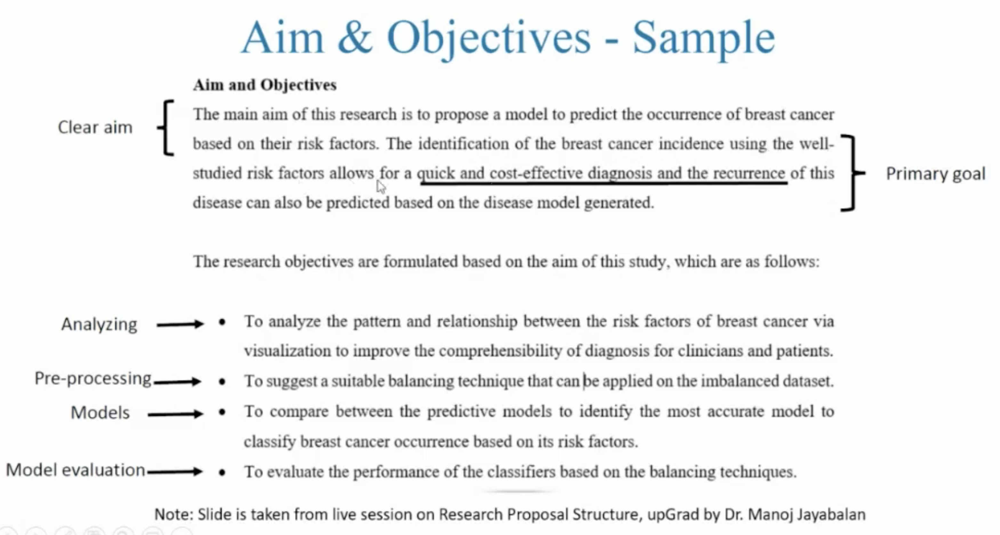
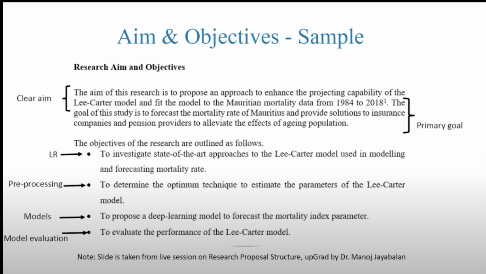

# Research Proposal Template

## Structure

Abstract
1. Background (Introduction)
   1. theme of your research in brief
   2. set the context of the problem and hypothesis
   3. should develop into motivation/purpose of the study
   4. introduction is not a literature review but its a glimpse of the total information
   5. last but not least present your general objective
2. Problem Statement (Challenges (covered, remained), Related Works)
   1. explore published thesis, scientific papers.
   2. avoid blogs and newspaper articles in systematic literature reviews
   3. look for survey paper, if there is none, you have a good chance of publishing the same based on SLR. You can check out related survey papers instead
   4. try to build a story line, talk about research gaps and challenges
   5. explore flowcharts and figures
   6. explain yourself: do not write something you are not confident about
   7. do not include generic details
   8. you can screen papers by their abstract and if that entice you read introduction, conclusion/future recommendation as well
3. Research Questions (IF ANY)
   1. What do you want to do?
4. Aim  and Objectives
   1. Aim: What're you doing?
    
    
   2. Objectives: How are you doing it?
      1. 3 objectives, max 4
5. Significance of the Study
   1. Reflect importance of your work
   2. expected outcome
   3. National & International Implications
6. Scope of the Study
   1. In scope
   2. Out Scope
   3. Reason for defining the scope
7. Research Methodology
   1. You need to address "HOW"?
   2. Describe how will you address different objectives
   3. Be consistent with the order of importance
   4. For each objective there should be a method
   5. For each method, cite the proper reference
   6. You can include following:
      1. workflow
      2. dataset description
      3. data preprocessing
      4. transformation/Augmentation
      5. Modelling Techniques
      6. Evaluation Metrics
8. Required Resources
9.  Research Plan
References

## Stages

- Read Papers
- Identify Research Gaps/Problems that exists
- Define what you're going to do
- Define your objectives
- Define your Research Methodology
- Gauge Resources Required
- Define your scope of work
- Work on defining your significane of the study
- Write you introduction/Background
- Write your Abstract
- Include your Research Plan
- Checklist
  - Revisit & Refine
  - Improve Technical Writing
  - Take care of Formatting
  - Take care of References

## Expectation Settings for each Section

##  Tips & Tricks on Presentation Skills

